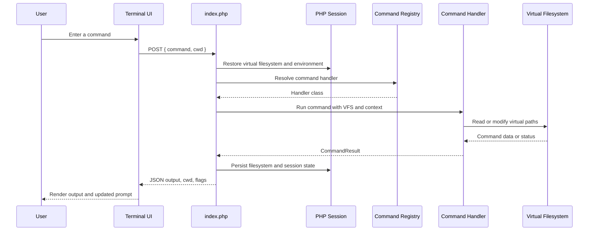
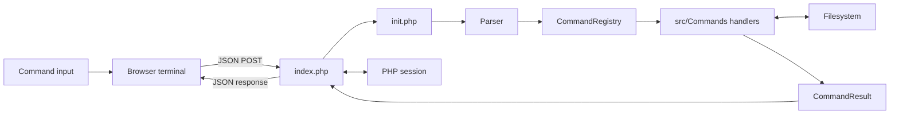
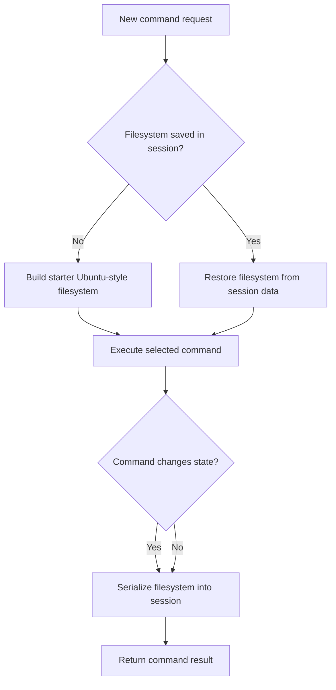
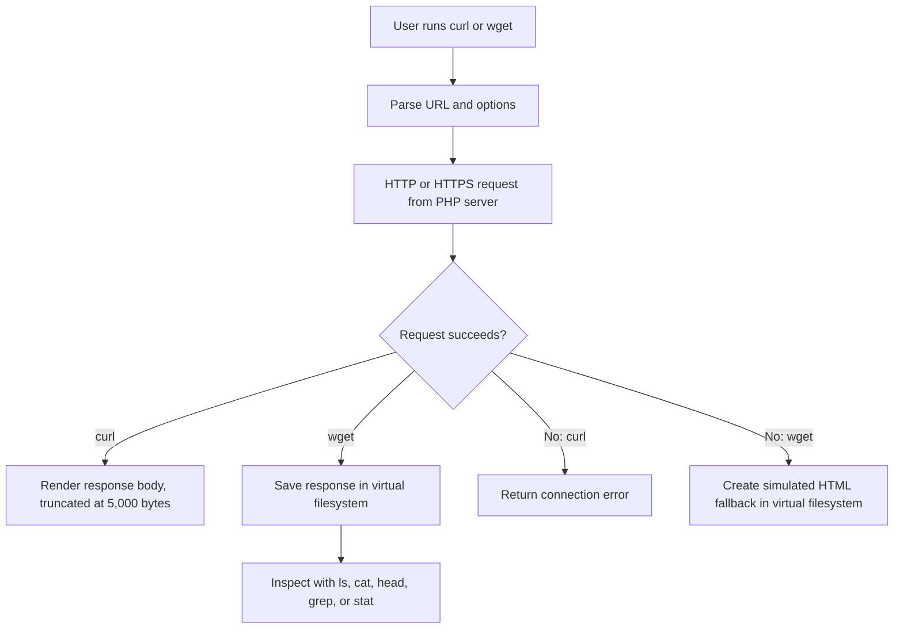

# PHP Ubuntu Terminal Emulator

A browser-based Ubuntu terminal emulator written in plain PHP. It provides a safe, session-backed virtual Linux environment for practicing common command-line workflows without running arbitrary shell commands on the web server.

The emulator presents an Ubuntu 24.04-inspired terminal interface, a virtual filesystem rooted at `/`, command history, aliases, environment variables, directory navigation, and a broad collection of simulated Linux commands.


## Live Network Support

Most commands are deliberately simulated, but `curl` and `wget` make real outbound HTTP or HTTPS requests from the PHP server. `curl` renders the fetched response in the terminal, while `wget` saves the downloaded response to the current directory in the session's virtual filesystem.


This split preserves a safe, virtual command-line learning environment while allowing users to practice real web retrieval workflows.

## Highlights

- Dependency-free PHP application with no framework, database, or build step.
- Responsive browser terminal UI with command history, tab completion, and familiar keyboard shortcuts.
- Per-session virtual filesystem with Unix-style paths, file metadata, permissions, ownership, and symbolic links.
- Simulated Ubuntu 24.04 environment including `/etc`, `/var/log`, `/home/visitor`, and system-information output.
- More than 200 registered commands across navigation, files, text processing, system administration, networking, packages, compression, and shell features.
- Live outbound web retrieval through `curl` and `wget`, subject to the PHP host's network policy.
- State persists for the duration of the browser session; it never writes the virtual filesystem to the host filesystem.

## Requirements

- PHP 8.1 or later, with sessions enabled.
- A web server capable of serving PHP, such as the PHP built-in server, Apache, or Nginx with PHP-FPM.

No Composer dependencies are required.

## Run Locally

From the project root, start PHP's built-in development server:

```powershell
php -S localhost:8000
```

Then open [http://localhost:8000](http://localhost:8000) in a browser.

To use a different document root explicitly:

```powershell
php -S localhost:8000 -t .
```

The entry point is `index.php`. A browser `GET` renders the terminal interface; a `POST` with JSON executes a command and returns JSON output for the interface.

## Application Workflow

The browser and PHP application communicate through the same `index.php` endpoint. The browser sends the typed command and current virtual directory as JSON; PHP restores session state, runs the matching command handler, saves any filesystem changes, and returns a structured result.



The command execution lifecycle is:

1. The browser accepts input, maintains local up/down-arrow history, and displays the submitted prompt line.
2. The client sends `command` and `cwd` to `index.php` with `fetch()`.
3. `init.php` expands a stored alias, expands environment variables, tokenizes the input, and finds the first parsed command segment.
4. `CommandRegistry` selects a command-group class, which receives the virtual filesystem, current directory, simulated identity, and environment.
5. The handler returns `CommandResult`, containing output plus optional `cwd`, `clear`, `error`, and `exit` flags.
6. The entry point serializes the virtual filesystem into the PHP session and returns the result as JSON.
7. The browser renders the output, updates the prompt when the directory changes, or clears/ends the view when requested.

## Quick Tour

Start with the built-in reference:

```text
help
man ls
whatis grep
```

Explore the initial virtual environment:

```text
pwd
ls -la
cat readme.txt
tree /home/visitor
cat /etc/os-release
```

Try common filesystem operations:

```text
mkdir -p projects/demo
touch projects/demo/notes.txt
cp readme.txt projects/demo/
ls -l projects/demo
chmod 600 projects/demo/notes.txt
stat projects/demo/notes.txt
```

Inspect simulated system and network information:

```text
uname -a
free
ps aux
ip route
netstat -tulpn
```

Retrieve a live web page or download it into the virtual filesystem:

```text
curl https://example.com
curl -L -i https://example.com
wget https://example.com/
cat index.html
wget -O example.html https://example.com/
ls -l example.html
```

`wget` stores downloaded content only in the current virtual directory. It is visible to subsequent emulator commands such as `ls`, `cat`, `head`, `grep`, and `stat`, but it is never written to the server's disk by the virtual filesystem.

## User Interface

The terminal UI includes the following interaction features:

| Interaction | Behavior |
| --- | --- |
| `Enter` | Runs the current command. |
| `Up` / `Down` | Navigates client-side command history. |
| `Tab` | Completes a known command name; press it twice to list ambiguous matches. |
| `Ctrl+C` | Cancels the current input line. |
| `Ctrl+L` | Clears the visible terminal output and redraws the welcome message. |
| `clear` or `reset` | Clears terminal output through the command API. |

The server also records up to 500 commands in session history, available through `history`.

## Command Coverage

Run `help` inside the emulator for its own categorized reference and `man <command>` for manual-page style help. The command registry groups support into the categories below.

| Category | Representative commands |
| --- | --- |
| Navigation | `pwd`, `cd`, `ls`, `dir`, `tree`, `pushd`, `popd`, `dirs` |
| Filesystem | `cat`, `touch`, `mkdir`, `rm`, `rmdir`, `mv`, `cp`, `ln`, `find`, `locate`, `file`, `stat`, `du`, `df`, `head`, `tail`, `wc`, `sort`, `uniq` |
| Text processing | `grep`, `sed`, `awk`, `less`, `more`, `nl`, `fold`, `fmt`, `diff`, `cmp`, `paste`, `rev`, `tac`, `od`, `hexdump`, `xxd` |
| System information | `uname`, `hostname`, `whoami`, `id`, `date`, `cal`, `uptime`, `free`, `lscpu`, `lsblk`, `dmesg`, `locale`, `env` |
| Processes | `ps`, `top`, `kill`, `pkill`, `jobs`, `bg`, `fg`, `watch`, `sleep`, `seq`, `yes` |
| Networking | `ping`, `ifconfig`, `ip`, `netstat`, `ss`, `curl`, `wget`, `traceroute`, `nslookup`, `dig`, `ssh`, `telnet`, `nc`, `nmap`, `whois` |
| Permissions and packages | `chmod`, `chown`, `chgrp`, `umask`, `sudo`, `apt`, `dpkg`, `snap`, `flatpak` |
| Archives | `tar`, `gzip`, `gunzip`, `zip`, `unzip`, `bzip2`, `xz`, `zcat`, `zgrep` |
| Shell environment | `echo`, `alias`, `unalias`, `export`, `unset`, `set`, `source`, `type`, `test`, `command`, `exit` |
| Utilities | `man`, `whatis`, `apropos`, `info`, `history`, `banner`, `figlet`, `fortune`, `factor`, `bc`, `expr`, `printf` |

Many commands intentionally provide representative output or a focused subset of their real GNU/Linux options. The goal is learning and exploration, not full shell compatibility.

## Architecture

```text
Browser UI
  |
  | POST { command, cwd }
  v
index.php
  |
  +-- init.php
  |     +-- CommandRegistry: maps commands to command groups
  |     +-- Parser: handles tokenization, quoting, variable expansion, and parsing
  |
  +-- Filesystem: in-memory virtual filesystem serialized into PHP session data
  |
  +-- BaseCommand and src/Commands/*: execute individual command behaviors
  |
  v
JSON { output, cwd, clear, error, exit }
```

### State and Data Flow



### Key Files

| Path | Responsibility |
| --- | --- |
| `index.php` | Web UI, session initialization, JSON command endpoint, and browser-side terminal behavior. |
| `init.php` | Lightweight autoloader, command registration, command dispatch, and session initialization. |
| `src/Filesystem.php` | Virtual filesystem data model, path resolution, metadata, files, directories, links, and serialization. |
| `src/Parser.php` | Command tokenization, quote handling, variable expansion, glob matching, pipe and redirect parsing. |
| `src/Registry.php` | Maps registered command names to their handler classes. |
| `src/BaseCommand.php` | Shared command interface, command context, helper methods, and result value object. |
| `src/Commands/` | Command-group implementations organized by domain. |

### Session Persistence Workflow

The project creates a new virtual filesystem only when the current PHP session has no saved filesystem data. Each POST request restores the saved array into a `Filesystem` object, executes a command, and saves it back to the session before returning the response.



## Virtual Environment

Each new PHP session receives its own in-memory filesystem. It contains a starter Linux-style layout, including:

```text
/
├── bin -> /usr/bin
├── dev
├── etc
│   ├── hostname
│   ├── os-release
│   ├── passwd
│   └── resolv.conf
├── home
│   └── visitor
│       ├── readme.txt
│       └── projects
├── proc
├── tmp
├── usr
└── var
    └── log
```

Files, directories, symlinks, aliases, environment variables, command history, the directory stack, and the virtual filesystem are stored in PHP session data. Clearing browser cookies or ending the PHP session resets this state.

## Live Network Workflow

`curl` and `wget` use PHP stream contexts and `file_get_contents()` to fetch remote HTTP or HTTPS content. Their behavior is intentionally different:

| Command | Live behavior | Supported options | Result |
| --- | --- | --- | --- |
| `curl URL` | Fetches the remote response body. | `-L`, `-s` / `--silent`, `-i` / `--include` | Renders progress-style output and up to 5,000 bytes of the response in the terminal. |
| `wget URL` | Fetches a remote response and determines a local output name from the URL. | `-O <file>` | Saves the response to the current virtual directory and prints a download-style report. |



Examples:

```text
# Print a real response body in the terminal
curl https://example.com

# Follow redirects and include response headers
curl -L -i https://example.com

# Download into the current virtual directory
wget https://example.com/
cat index.html

# Choose the virtual output filename
wget -O reference.html https://example.com/
head reference.html
```

Network availability depends on the deployment environment. The PHP runtime must allow URL-aware stream wrappers and outbound connections. `curl` reports a failed connection when it cannot fetch the resource. `wget` instead creates and saves a clearly labeled simulated HTML fallback when a fetch fails, so users can still practice the download workflow.

## Security Model and Limitations

The emulator is designed to avoid executing arbitrary terminal commands on the server:

- File operations target the in-memory virtual filesystem only.
- Package, process, service, permission, and most system commands are simulated.
- `sudo` changes the simulated command context; it does not elevate server permissions.
- The application does not expose a terminal shell such as `exec()`, `shell_exec()`, or `system()` for user-entered commands.

`curl` and `wget` are usable live network commands: both request remote HTTP or HTTPS content from the PHP server when the hosting environment permits it. Other network-oriented commands can also perform DNS resolution, socket checks, or outbound lookups before producing simulated output. Do not deploy this project to an untrusted public environment without reviewing and restricting outbound-network capabilities, including access to private or internal addresses.

The parser recognizes quoted arguments, variable syntax, pipes, and output redirects, but the command dispatcher currently executes only the first parsed command segment. Consequently, pipelines such as `cat readme.txt | grep PHP` and redirection such as `echo hello > file.txt` are not executed as real shell pipelines or redirects. Several command implementations display guidance or simulated results for these workflows.

## Extending the Emulator

To add a command:

1. Select the appropriate class in `src/Commands/`, or create a new command group that extends `BaseCommand`.
2. Add a private method named `execute<CommandName>()`, accepting an argument array and returning `CommandResult`.
3. Register the command name and handler class in `registerAllCommands()` in `init.php`.
4. Update the `help` categories in `MiscCommands::executeHelp()` when appropriate.
5. Add focused tests before expanding more complex behavior.

Every command receives a `Filesystem` instance, current working directory, simulated user identity, and environment. Commands should use the inherited `resolve()` helper to safely map relative and home-directory paths into the virtual filesystem.

## Validation

This repository does not currently include an automated test suite. You can check all PHP source files for syntax errors with:

```powershell
Get-ChildItem -Recurse -Filter *.php | ForEach-Object { php -l $_.FullName }
```

For a manual smoke test, run the local server and verify that these commands work in a browser:

```text
help
ls -la
mkdir -p sandbox/example
touch sandbox/example/hello.txt
ls -l sandbox/example
uname -a
```

## Repository Status

The project does not currently include Git metadata, a license file, or automated tests. Before publishing, initialize Git and choose an appropriate license:

```powershell
git init
git add .
git commit -m "Initial commit"
```

## License

No license has been specified yet. Add a `LICENSE` file before publishing if you want to grant others permission to use, modify, and distribute the project.